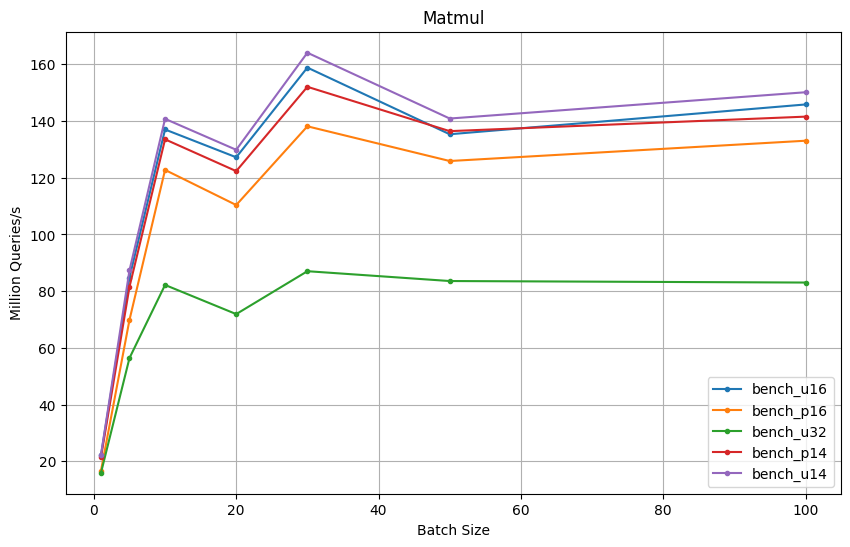
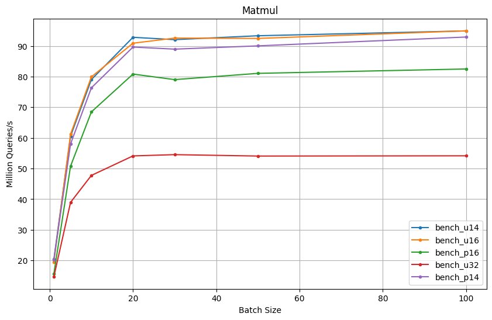

# Benchmark Results

## H100



```
bench_u16/u16 x u16 → u16 (200000 x 31)
                        time:   [9.0188 ms 9.0232 ms 9.0285 ms]
                        thrpt:  [22.152 Melem/s 22.165 Melem/s 22.176 Melem/s]
Found 2 outliers among 100 measurements (2.00%)
  1 (1.00%) high mild
  1 (1.00%) high severe
bench_u16/u16 x u16 → u16 (200000 x 155)
                        time:   [11.686 ms 11.793 ms 11.919 ms]
                        thrpt:  [83.898 Melem/s 84.795 Melem/s 85.574 Melem/s]
Found 11 outliers among 100 measurements (11.00%)
  1 (1.00%) high mild
  10 (10.00%) high severe
bench_u16/u16 x u16 → u16 (200000 x 310)
                        time:   [14.569 ms 14.596 ms 14.632 ms]
                        thrpt:  [136.69 Melem/s 137.02 Melem/s 137.28 Melem/s]
Found 7 outliers among 100 measurements (7.00%)
  4 (4.00%) high mild
  3 (3.00%) high severe
bench_u16/u16 x u16 → u16 (200000 x 620)
                        time:   [31.397 ms 31.444 ms 31.495 ms]
                        thrpt:  [127.00 Melem/s 127.21 Melem/s 127.40 Melem/s]
Found 23 outliers among 100 measurements (23.00%)
  15 (15.00%) low severe
  5 (5.00%) low mild
  2 (2.00%) high mild
  1 (1.00%) high severe
bench_u16/u16 x u16 → u16 (200000 x 930)
                        time:   [37.602 ms 37.770 ms 37.984 ms]
                        thrpt:  [157.96 Melem/s 158.86 Melem/s 159.57 Melem/s]
Found 11 outliers among 100 measurements (11.00%)
  1 (1.00%) high mild
  10 (10.00%) high severe
Benchmarking bench_u16/u16 x u16 → u16 (200000 x 1550): Warming up for 3.0000 s
Warning: Unable to complete 100 samples in 5.0s. You may wish to increase target time to 7.7s, or reduce sample count to 60.
bench_u16/u16 x u16 → u16 (200000 x 1550)
                        time:   [72.500 ms 73.889 ms 75.575 ms]
                        thrpt:  [132.32 Melem/s 135.34 Melem/s 137.93 Melem/s]
Found 11 outliers among 100 measurements (11.00%)
  11 (11.00%) high severe
Benchmarking bench_u16/u16 x u16 → u16 (200000 x 3100): Warming up for 3.0000 s
Warning: Unable to complete 100 samples in 5.0s. You may wish to increase target time to 15.2s, or reduce sample count to 30.
bench_u16/u16 x u16 → u16 (200000 x 3100)
                        time:   [135.77 ms 137.13 ms 138.69 ms]
                        thrpt:  [144.20 Melem/s 145.85 Melem/s 147.30 Melem/s]
Found 8 outliers among 100 measurements (8.00%)
  2 (2.00%) high mild
  6 (6.00%) high severe

bench_p16/p16 x p16 → p16 (200000 x 31)
                        time:   [11.971 ms 11.978 ms 11.986 ms]
                        thrpt:  [16.685 Melem/s 16.697 Melem/s 16.707 Melem/s]
Found 4 outliers among 100 measurements (4.00%)
  1 (1.00%) high mild
  3 (3.00%) high severe
bench_p16/p16 x p16 → p16 (200000 x 155)
                        time:   [14.296 ms 14.321 ms 14.351 ms]
                        thrpt:  [69.682 Melem/s 69.829 Melem/s 69.949 Melem/s]
Found 2 outliers among 100 measurements (2.00%)
  1 (1.00%) high mild
  1 (1.00%) high severe
bench_p16/p16 x p16 → p16 (200000 x 310)
                        time:   [16.282 ms 16.293 ms 16.304 ms]
                        thrpt:  [122.67 Melem/s 122.76 Melem/s 122.83 Melem/s]
Found 1 outliers among 100 measurements (1.00%)
  1 (1.00%) high severe
bench_p16/p16 x p16 → p16 (200000 x 620)
                        time:   [36.176 ms 36.242 ms 36.307 ms]
                        thrpt:  [110.17 Melem/s 110.37 Melem/s 110.57 Melem/s]
bench_p16/p16 x p16 → p16 (200000 x 930)
                        time:   [42.643 ms 43.433 ms 44.404 ms]
                        thrpt:  [135.12 Melem/s 138.14 Melem/s 140.70 Melem/s]
Found 23 outliers among 100 measurements (23.00%)
  23 (23.00%) high severe
Benchmarking bench_p16/p16 x p16 → p16 (200000 x 1550): Warming up for 3.0000 s
Warning: Unable to complete 100 samples in 5.0s. You may wish to increase target time to 8.7s, or reduce sample count to 50.
bench_p16/p16 x p16 → p16 (200000 x 1550)
                        time:   [78.425 ms 79.430 ms 80.602 ms]
                        thrpt:  [124.07 Melem/s 125.90 Melem/s 127.51 Melem/s]
Found 15 outliers among 100 measurements (15.00%)
  2 (2.00%) high mild
  13 (13.00%) high severe
Benchmarking bench_p16/p16 x p16 → p16 (200000 x 3100): Warming up for 3.0000 s
Warning: Unable to complete 100 samples in 5.0s. You may wish to increase target time to 17.0s, or reduce sample count to 20.
bench_p16/p16 x p16 → p16 (200000 x 3100)
                        time:   [149.34 ms 150.31 ms 151.47 ms]
                        thrpt:  [132.04 Melem/s 133.06 Melem/s 133.93 Melem/s]
Found 15 outliers among 100 measurements (15.00%)
  9 (9.00%) high mild
  6 (6.00%) high severe

bench_u32/u32 x u32 → u32 (200000 x 31)
                        time:   [12.493 ms 12.551 ms 12.620 ms]
                        thrpt:  [15.847 Melem/s 15.935 Melem/s 16.009 Melem/s]
Found 10 outliers among 100 measurements (10.00%)
  10 (10.00%) high severe
bench_u32/u32 x u32 → u32 (200000 x 155)
                        time:   [17.705 ms 17.738 ms 17.779 ms]
                        thrpt:  [56.247 Melem/s 56.376 Melem/s 56.482 Melem/s]
Found 14 outliers among 100 measurements (14.00%)
  5 (5.00%) high mild
  9 (9.00%) high severe
bench_u32/u32 x u32 → u32 (200000 x 310)
                        time:   [24.314 ms 24.337 ms 24.373 ms]
                        thrpt:  [82.059 Melem/s 82.178 Melem/s 82.257 Melem/s]
Found 4 outliers among 100 measurements (4.00%)
  3 (3.00%) high mild
  1 (1.00%) high severe
Benchmarking bench_u32/u32 x u32 → u32 (200000 x 620): Warming up for 3.0000 s
Warning: Unable to complete 100 samples in 5.0s. You may wish to increase target time to 6.0s, or reduce sample count to 80.
bench_u32/u32 x u32 → u32 (200000 x 620)
                        time:   [54.761 ms 55.638 ms 56.672 ms]
                        thrpt:  [70.581 Melem/s 71.893 Melem/s 73.045 Melem/s]
Found 9 outliers among 100 measurements (9.00%)
  1 (1.00%) high mild
  8 (8.00%) high severe
Benchmarking bench_u32/u32 x u32 → u32 (200000 x 930): Warming up for 3.0000 s
Warning: Unable to complete 100 samples in 5.0s. You may wish to increase target time to 7.2s, or reduce sample count to 60.
bench_u32/u32 x u32 → u32 (200000 x 930)
                        time:   [67.528 ms 68.944 ms 70.593 ms]
                        thrpt:  [84.995 Melem/s 87.028 Melem/s 88.852 Melem/s]
Found 14 outliers among 100 measurements (14.00%)
  2 (2.00%) high mild
  12 (12.00%) high severe
Benchmarking bench_u32/u32 x u32 → u32 (200000 x 1550): Warming up for 3.0000 s
Warning: Unable to complete 100 samples in 5.0s. You may wish to increase target time to 13.8s, or reduce sample count to 30.
bench_u32/u32 x u32 → u32 (200000 x 1550)
                        time:   [119.50 ms 119.68 ms 119.88 ms]
                        thrpt:  [83.416 Melem/s 83.559 Melem/s 83.685 Melem/s]
Found 11 outliers among 100 measurements (11.00%)
  3 (3.00%) high mild
  8 (8.00%) high severe
Benchmarking bench_u32/u32 x u32 → u32 (200000 x 3100): Warming up for 3.0000 s
Warning: Unable to complete 100 samples in 5.0s. You may wish to increase target time to 31.7s, or reduce sample count to 10.
bench_u32/u32 x u32 → u32 (200000 x 3100)
                        time:   [238.03 ms 240.90 ms 244.11 ms]
                        thrpt:  [81.930 Melem/s 83.023 Melem/s 84.024 Melem/s]
Found 11 outliers among 100 measurements (11.00%)
  1 (1.00%) high mild
  10 (10.00%) high severe

bench_p14/p14 x p14 → p14 (200000 x 31)
                        time:   [9.3062 ms 9.3228 ms 9.3464 ms]
                        thrpt:  [21.399 Melem/s 21.453 Melem/s 21.491 Melem/s]
Found 3 outliers among 100 measurements (3.00%)
  3 (3.00%) high severe
bench_p14/p14 x p14 → p14 (200000 x 155)
                        time:   [11.942 ms 12.270 ms 12.650 ms]
                        thrpt:  [79.048 Melem/s 81.500 Melem/s 83.737 Melem/s]
Found 10 outliers among 100 measurements (10.00%)
  10 (10.00%) high severe
bench_p14/p14 x p14 → p14 (200000 x 310)
                        time:   [14.639 ms 14.976 ms 15.383 ms]
                        thrpt:  [130.02 Melem/s 133.55 Melem/s 136.62 Melem/s]
Found 9 outliers among 100 measurements (9.00%)
  2 (2.00%) high mild
  7 (7.00%) high severe
bench_p14/p14 x p14 → p14 (200000 x 620)
                        time:   [32.053 ms 32.698 ms 33.514 ms]
                        thrpt:  [119.35 Melem/s 122.33 Melem/s 124.79 Melem/s]
Found 5 outliers among 100 measurements (5.00%)
  5 (5.00%) high severe
bench_p14/p14 x p14 → p14 (200000 x 930)
                        time:   [39.051 ms 39.453 ms 39.974 ms]
                        thrpt:  [150.10 Melem/s 152.08 Melem/s 153.65 Melem/s]
Found 13 outliers among 100 measurements (13.00%)
  4 (4.00%) high mild
  9 (9.00%) high severe
Benchmarking bench_p14/p14 x p14 → p14 (200000 x 1550): Warming up for 3.0000 s
Warning: Unable to complete 100 samples in 5.0s. You may wish to increase target time to 7.8s, or reduce sample count to 60.
bench_p14/p14 x p14 → p14 (200000 x 1550)
                        time:   [72.357 ms 73.296 ms 74.451 ms]
                        thrpt:  [134.32 Melem/s 136.43 Melem/s 138.20 Melem/s]
Found 12 outliers among 100 measurements (12.00%)
  2 (2.00%) high mild
  10 (10.00%) high severe
Benchmarking bench_p14/p14 x p14 → p14 (200000 x 3100): Warming up for 3.0000 s
Warning: Unable to complete 100 samples in 5.0s. You may wish to increase target time to 16.0s, or reduce sample count to 30.
bench_p14/p14 x p14 → p14 (200000 x 3100)
                        time:   [140.72 ms 141.29 ms 141.99 ms]
                        thrpt:  [140.85 Melem/s 141.55 Melem/s 142.13 Melem/s]
Found 10 outliers among 100 measurements (10.00%)
  6 (6.00%) high mild
  4 (4.00%) high severe

bench_u14/u14 x u14 → u14 (200000 x 31)
                        time:   [8.9670 ms 8.9698 ms 8.9727 ms]
                        thrpt:  [22.290 Melem/s 22.297 Melem/s 22.304 Melem/s]
bench_u14/u14 x u14 → u14 (200000 x 155)
                        time:   [11.408 ms 11.451 ms 11.506 ms]
                        thrpt:  [86.907 Melem/s 87.328 Melem/s 87.661 Melem/s]
Found 9 outliers among 100 measurements (9.00%)
  5 (5.00%) high mild
  4 (4.00%) high severe
bench_u14/u14 x u14 → u14 (200000 x 310)
                        time:   [14.171 ms 14.207 ms 14.250 ms]
                        thrpt:  [140.35 Melem/s 140.77 Melem/s 141.13 Melem/s]
Found 4 outliers among 100 measurements (4.00%)
  3 (3.00%) high mild
  1 (1.00%) high severe
bench_u14/u14 x u14 → u14 (200000 x 620)
                        time:   [30.761 ms 30.805 ms 30.855 ms]
                        thrpt:  [129.64 Melem/s 129.85 Melem/s 130.04 Melem/s]
Found 5 outliers among 100 measurements (5.00%)
  2 (2.00%) high mild
  3 (3.00%) high severe
bench_u14/u14 x u14 → u14 (200000 x 930)
                        time:   [36.482 ms 36.563 ms 36.665 ms]
                        thrpt:  [163.64 Melem/s 164.10 Melem/s 164.47 Melem/s]
Found 11 outliers among 100 measurements (11.00%)
  3 (3.00%) low mild
  2 (2.00%) high mild
  6 (6.00%) high severe
Benchmarking bench_u14/u14 x u14 → u14 (200000 x 1550): Warming up for 3.0000 s
Warning: Unable to complete 100 samples in 5.0s. You may wish to increase target time to 7.4s, or reduce sample count to 60.
bench_u14/u14 x u14 → u14 (200000 x 1550)
                        time:   [70.108 ms 70.980 ms 72.037 ms]
                        thrpt:  [138.82 Melem/s 140.89 Melem/s 142.64 Melem/s]
Found 9 outliers among 100 measurements (9.00%)
  4 (4.00%) high mild
  5 (5.00%) high severe
Benchmarking bench_u14/u14 x u14 → u14 (200000 x 3100): Warming up for 3.0000 s
Warning: Unable to complete 100 samples in 5.0s. You may wish to increase target time to 14.9s, or reduce sample count to 30.
bench_u14/u14 x u14 → u14 (200000 x 3100)
                        time:   [132.07 ms 133.20 ms 134.51 ms]
                        thrpt:  [148.69 Melem/s 150.16 Melem/s 151.44 Melem/s]
Found 6 outliers among 100 measurements (6.00%)
  2 (2.00%) high mild
  4 (4.00%) high severe
```


## RTX4090



```
     Running benches/engines.rs (target/release/deps/engines-3eaeb174bd34b641)
Gnuplot not found, using plotters backend
Benchmarking bench_u16/u16 x u16 → u16 (200000 x 31): Wa
Benchmarking bench_u16/u16 x u16 → u16 (200000 x 31): Collecting 100 samples in estimated 5.1335 s (500 iteratio
Benchmarking bench_u16/u16 x u16 → u16 (200000 x 31): An
bench_u16/u16 x u16 → u16 (200000 x 31)
                        time:   [10.246 ms 10.247 ms 10.248 ms]
                        thrpt:  [19.516 Melem/s 19.518 Melem/s 19.520 Melem/s]
                 change:
                        time:   [+0.4421% +0.4558% +0.4700%] (p = 0.00 < 0.05)
                        thrpt:  [-0.4678% -0.4538% -0.4401%]
                        Change within noise threshold.
Found 1 outliers among 100 measurements (1.00%)
  1 (1.00%) high mild
Benchmarking bench_u16/u16 x u16 → u16 (200000 x 155): W
Benchmarking bench_u16/u16 x u16 → u16 (200000 x 155): Collecting 100 samples in estimated 6.5633 s (400 iterati
Benchmarking bench_u16/u16 x u16 → u16 (200000 x 155): A
bench_u16/u16 x u16 → u16 (200000 x 155)
                        time:   [16.334 ms 16.337 ms 16.339 ms]
                        thrpt:  [61.202 Melem/s 61.212 Melem/s 61.222 Melem/s]
                 change:
                        time:   [-0.0148% +0.0136% +0.0402%] (p = 0.34 > 0.05)
                        thrpt:  [-0.0402% -0.0136% +0.0148%]
                        No change in performance detected.
Found 3 outliers among 100 measurements (3.00%)
  3 (3.00%) high mild
Benchmarking bench_u16/u16 x u16 → u16 (200000 x 310): W
Benchmarking bench_u16/u16 x u16 → u16 (200000 x 310): Collecting 100 samples in estimated 5.0616 s (200 iterati
Benchmarking bench_u16/u16 x u16 → u16 (200000 x 310): A
bench_u16/u16 x u16 → u16 (200000 x 310)
                        time:   [25.013 ms 25.027 ms 25.042 ms]
                        thrpt:  [79.866 Melem/s 79.912 Melem/s 79.957 Melem/s]
                 change:
                        time:   [-0.1355% -0.0560% +0.0193%] (p = 0.15 > 0.05)
                        thrpt:  [-0.0193% +0.0560% +0.1357%]
                        No change in performance detected.
Benchmarking bench_u16/u16 x u16 → u16 (200000 x 620): W
Benchmarking bench_u16/u16 x u16 → u16 (200000 x 620): Collecting 100 samples in estimated 8.9154 s (200 iterati
Benchmarking bench_u16/u16 x u16 → u16 (200000 x 620): A
bench_u16/u16 x u16 → u16 (200000 x 620)
                        time:   [43.992 ms 44.000 ms 44.008 ms]
                        thrpt:  [90.893 Melem/s 90.910 Melem/s 90.926 Melem/s]
                 change:
                        time:   [+1.5398% +1.5743% +1.6071%] (p = 0.00 < 0.05)
                        thrpt:  [-1.5817% -1.5499% -1.5164%]
                        Performance has regressed.
Found 1 outliers among 100 measurements (1.00%)
  1 (1.00%) high mild
Benchmarking bench_u16/u16 x u16 → u16 (200000 x 930): Warming up for 3.0000 s
Warning: Unable to complete 100 samples in 5.0s. You may wish to increase target time to 6.6s, or reduce sample count to 70.
Benchmarking bench_u16/u16 x u16 → u16 (200000 x 930): Collecting 100 samples in estimated 6.6405 s (100 iterati
Benchmarking bench_u16/u16 x u16 → u16 (200000 x 930): A
bench_u16/u16 x u16 → u16 (200000 x 930)
                        time:   [64.723 ms 64.809 ms 64.911 ms]
                        thrpt:  [92.435 Melem/s 92.580 Melem/s 92.703 Melem/s]
                 change:
                        time:   [-2.0064% -1.7962% -1.5939%] (p = 0.00 < 0.05)
                        thrpt:  [+1.6197% +1.8291% +2.0475%]
                        Performance has improved.
Found 10 outliers among 100 measurements (10.00%)
  3 (3.00%) high mild
  7 (7.00%) high severe
Benchmarking bench_u16/u16 x u16 → u16 (200000 x 1550): Warming up for 3.0000 s
Warning: Unable to complete 100 samples in 5.0s. You may wish to increase target time to 11.4s, or reduce sample count to 40.
Benchmarking bench_u16/u16 x u16 → u16 (200000 x 1550): Collecting 100 samples in estimated 11.389 s (100 iterat
Benchmarking bench_u16/u16 x u16 → u16 (200000 x 1550): 
bench_u16/u16 x u16 → u16 (200000 x 1550)
                        time:   [108.10 ms 108.14 ms 108.20 ms]
                        thrpt:  [92.424 Melem/s 92.469 Melem/s 92.510 Melem/s]
                 change:
                        time:   [+0.6293% +0.7007% +0.7723%] (p = 0.00 < 0.05)
                        thrpt:  [-0.7664% -0.6958% -0.6254%]
                        Change within noise threshold.
Found 12 outliers among 100 measurements (12.00%)
  4 (4.00%) high mild
  8 (8.00%) high severe
Benchmarking bench_u16/u16 x u16 → u16 (200000 x 3100): Warming up for 3.0000 s
Warning: Unable to complete 100 samples in 5.0s. You may wish to increase target time to 23.5s, or reduce sample count to 20.
Benchmarking bench_u16/u16 x u16 → u16 (200000 x 3100): Collecting 100 samples in estimated 23.524 s (100 iterat
Benchmarking bench_u16/u16 x u16 → u16 (200000 x 3100): 
bench_u16/u16 x u16 → u16 (200000 x 3100)
                        time:   [210.28 ms 210.64 ms 211.05 ms]
                        thrpt:  [94.765 Melem/s 94.949 Melem/s 95.113 Melem/s]
                 change:
                        time:   [-1.1934% -0.9468% -0.6993%] (p = 0.00 < 0.05)
                        thrpt:  [+0.7042% +0.9558% +1.2078%]
                        Change within noise threshold.
Found 12 outliers among 100 measurements (12.00%)
  11 (11.00%) high mild
  1 (1.00%) high severe

Benchmarking bench_p16/p16 x p16 → p16 (200000 x 31): Wa
Benchmarking bench_p16/p16 x p16 → p16 (200000 x 31): Collecting 100 samples in estimated 5.0972 s (400 iteratio
Benchmarking bench_p16/p16 x p16 → p16 (200000 x 31): An
bench_p16/p16 x p16 → p16 (200000 x 31)
                        time:   [12.741 ms 12.742 ms 12.743 ms]
                        thrpt:  [15.695 Melem/s 15.696 Melem/s 15.698 Melem/s]
                 change:
                        time:   [-0.0156% -0.0037% +0.0093%] (p = 0.58 > 0.05)
                        thrpt:  [-0.0093% +0.0037% +0.0156%]
                        No change in performance detected.
Found 1 outliers among 100 measurements (1.00%)
  1 (1.00%) high mild
Benchmarking bench_p16/p16 x p16 → p16 (200000 x 155): W
Benchmarking bench_p16/p16 x p16 → p16 (200000 x 155): Collecting 100 samples in estimated 5.9302 s (300 iterati
Benchmarking bench_p16/p16 x p16 → p16 (200000 x 155): A
bench_p16/p16 x p16 → p16 (200000 x 155)
                        time:   [19.691 ms 19.693 ms 19.695 ms]
                        thrpt:  [50.775 Melem/s 50.781 Melem/s 50.785 Melem/s]
                 change:
                        time:   [-0.0102% +0.0053% +0.0214%] (p = 0.50 > 0.05)
                        thrpt:  [-0.0214% -0.0053% +0.0102%]
                        No change in performance detected.
Found 6 outliers among 100 measurements (6.00%)
  1 (1.00%) low mild
  3 (3.00%) high mild
  2 (2.00%) high severe
Benchmarking bench_p16/p16 x p16 → p16 (200000 x 310): W
Benchmarking bench_p16/p16 x p16 → p16 (200000 x 310): Collecting 100 samples in estimated 5.8978 s (200 iterati
Benchmarking bench_p16/p16 x p16 → p16 (200000 x 310): A
bench_p16/p16 x p16 → p16 (200000 x 310)
                        time:   [29.198 ms 29.207 ms 29.218 ms]
                        thrpt:  [68.452 Melem/s 68.476 Melem/s 68.498 Melem/s]
                 change:
                        time:   [-1.2430% -1.2007% -1.1591%] (p = 0.00 < 0.05)
                        thrpt:  [+1.1727% +1.2153% +1.2587%]
                        Performance has improved.
Found 2 outliers among 100 measurements (2.00%)
  1 (1.00%) high mild
  1 (1.00%) high severe
Benchmarking bench_p16/p16 x p16 → p16 (200000 x 620): Warming up for 3.0000 s
Warning: Unable to complete 100 samples in 5.0s. You may wish to increase target time to 5.1s, or reduce sample count to 90.
Benchmarking bench_p16/p16 x p16 → p16 (200000 x 620): Collecting 100 samples in estimated 5.0627 s (100 iterati
Benchmarking bench_p16/p16 x p16 → p16 (200000 x 620): A
bench_p16/p16 x p16 → p16 (200000 x 620)
                        time:   [49.436 ms 49.483 ms 49.552 ms]
                        thrpt:  [80.724 Melem/s 80.836 Melem/s 80.913 Melem/s]
                 change:
                        time:   [-0.0850% +0.0685% +0.2307%] (p = 0.43 > 0.05)
                        thrpt:  [-0.2302% -0.0684% +0.0851%]
                        No change in performance detected.
Found 2 outliers among 100 measurements (2.00%)
  1 (1.00%) high mild
  1 (1.00%) high severe
Benchmarking bench_p16/p16 x p16 → p16 (200000 x 930): Warming up for 3.0000 s
Warning: Unable to complete 100 samples in 5.0s. You may wish to increase target time to 7.7s, or reduce sample count to 60.
Benchmarking bench_p16/p16 x p16 → p16 (200000 x 930): Collecting 100 samples in estimated 7.7488 s (100 iterati
Benchmarking bench_p16/p16 x p16 → p16 (200000 x 930): A
bench_p16/p16 x p16 → p16 (200000 x 930)
                        time:   [75.845 ms 75.923 ms 76.018 ms]
                        thrpt:  [78.929 Melem/s 79.027 Melem/s 79.108 Melem/s]
                 change:
                        time:   [+0.1613% +1.1255% +1.7160%] (p = 0.00 < 0.05)
                        thrpt:  [-1.6871% -1.1130% -0.1610%]
                        Change within noise threshold.
Found 2 outliers among 100 measurements (2.00%)
  1 (1.00%) high mild
  1 (1.00%) high severe
Benchmarking bench_p16/p16 x p16 → p16 (200000 x 1550): Warming up for 3.0000 s
Warning: Unable to complete 100 samples in 5.0s. You may wish to increase target time to 12.9s, or reduce sample count to 30.
Benchmarking bench_p16/p16 x p16 → p16 (200000 x 1550): Collecting 100 samples in estimated 12.906 s (100 iterat
Benchmarking bench_p16/p16 x p16 → p16 (200000 x 1550): 
bench_p16/p16 x p16 → p16 (200000 x 1550)
                        time:   [123.21 ms 123.35 ms 123.54 ms]
                        thrpt:  [80.944 Melem/s 81.070 Melem/s 81.163 Melem/s]
Found 7 outliers among 100 measurements (7.00%)
  6 (6.00%) high mild
  1 (1.00%) high severe
Benchmarking bench_p16/p16 x p16 → p16 (200000 x 3100): Warming up for 3.0000 s
Warning: Unable to complete 100 samples in 5.0s. You may wish to increase target time to 26.6s, or reduce sample count to 10.
Benchmarking bench_p16/p16 x p16 → p16 (200000 x 3100): Collecting 100 samples in estimated 26.554 s (100 iterat
Benchmarking bench_p16/p16 x p16 → p16 (200000 x 3100): 
bench_p16/p16 x p16 → p16 (200000 x 3100)
                        time:   [242.10 ms 242.43 ms 242.75 ms]
                        thrpt:  [82.389 Melem/s 82.497 Melem/s 82.609 Melem/s]

Benchmarking bench_u32/u32 x u32 → u32 (200000 x 31): Wa
Benchmarking bench_u32/u32 x u32 → u32 (200000 x 31): Collecting 100 samples in estimated 5.4258 s (400 iteratio
Benchmarking bench_u32/u32 x u32 → u32 (200000 x 31): An
bench_u32/u32 x u32 → u32 (200000 x 31)
                        time:   [13.564 ms 13.569 ms 13.577 ms]
                        thrpt:  [14.731 Melem/s 14.739 Melem/s 14.745 Melem/s]
Found 6 outliers among 100 measurements (6.00%)
  1 (1.00%) high mild
  5 (5.00%) high severe
Benchmarking bench_u32/u32 x u32 → u32 (200000 x 155): W
Benchmarking bench_u32/u32 x u32 → u32 (200000 x 155): Collecting 100 samples in estimated 5.1905 s (200 iterati
Benchmarking bench_u32/u32 x u32 → u32 (200000 x 155): A
bench_u32/u32 x u32 → u32 (200000 x 155)
                        time:   [25.656 ms 25.671 ms 25.687 ms]
                        thrpt:  [38.931 Melem/s 38.954 Melem/s 38.977 Melem/s]
Found 1 outliers among 100 measurements (1.00%)
  1 (1.00%) high mild
Benchmarking bench_u32/u32 x u32 → u32 (200000 x 310): W
Benchmarking bench_u32/u32 x u32 → u32 (200000 x 310): Collecting 100 samples in estimated 8.4914 s (200 iterati
Benchmarking bench_u32/u32 x u32 → u32 (200000 x 310): A
bench_u32/u32 x u32 → u32 (200000 x 310)
                        time:   [41.877 ms 41.886 ms 41.896 ms]
                        thrpt:  [47.737 Melem/s 47.749 Melem/s 47.759 Melem/s]
Found 2 outliers among 100 measurements (2.00%)
  2 (2.00%) high severe
Benchmarking bench_u32/u32 x u32 → u32 (200000 x 620): Warming up for 3.0000 s
Warning: Unable to complete 100 samples in 5.0s. You may wish to increase target time to 7.6s, or reduce sample count to 60.
Benchmarking bench_u32/u32 x u32 → u32 (200000 x 620): Collecting 100 samples in estimated 7.6141 s (100 iterati
Benchmarking bench_u32/u32 x u32 → u32 (200000 x 620): A
bench_u32/u32 x u32 → u32 (200000 x 620)
                        time:   [73.886 ms 73.908 ms 73.933 ms]
                        thrpt:  [54.103 Melem/s 54.121 Melem/s 54.138 Melem/s]
Found 2 outliers among 100 measurements (2.00%)
  1 (1.00%) high mild
  1 (1.00%) high severe
Benchmarking bench_u32/u32 x u32 → u32 (200000 x 930): Warming up for 3.0000 s
Warning: Unable to complete 100 samples in 5.0s. You may wish to increase target time to 11.7s, or reduce sample count to 40.
Benchmarking bench_u32/u32 x u32 → u32 (200000 x 930): Collecting 100 samples in estimated 11.735 s (100 iterati
Benchmarking bench_u32/u32 x u32 → u32 (200000 x 930): A
bench_u32/u32 x u32 → u32 (200000 x 930)
                        time:   [109.99 ms 110.02 ms 110.05 ms]
                        thrpt:  [54.520 Melem/s 54.536 Melem/s 54.550 Melem/s]
Found 8 outliers among 100 measurements (8.00%)
  1 (1.00%) low mild
  4 (4.00%) high mild
  3 (3.00%) high severe
Benchmarking bench_u32/u32 x u32 → u32 (200000 x 1550): Warming up for 3.0000 s
Warning: Unable to complete 100 samples in 5.0s. You may wish to increase target time to 20.9s, or reduce sample count to 20.
Benchmarking bench_u32/u32 x u32 → u32 (200000 x 1550): Collecting 100 samples in estimated 20.857 s (100 iterat
Benchmarking bench_u32/u32 x u32 → u32 (200000 x 1550): 
bench_u32/u32 x u32 → u32 (200000 x 1550)
                        time:   [184.75 ms 184.93 ms 185.10 ms]
                        thrpt:  [54.025 Melem/s 54.075 Melem/s 54.126 Melem/s]
Benchmarking bench_u32/u32 x u32 → u32 (200000 x 3100): Warming up for 3.0000 s
Warning: Unable to complete 100 samples in 5.0s. You may wish to increase target time to 47.1s, or reduce sample count to 10.
Benchmarking bench_u32/u32 x u32 → u32 (200000 x 3100): Collecting 100 samples in estimated 47.068 s (100 iterat
Benchmarking bench_u32/u32 x u32 → u32 (200000 x 3100): 
bench_u32/u32 x u32 → u32 (200000 x 3100)
                        time:   [368.93 ms 369.32 ms 369.70 ms]
                        thrpt:  [54.098 Melem/s 54.153 Melem/s 54.211 Melem/s]

Benchmarking bench_p14/p14 x p14 → p14 (200000 x 31): Wa
Benchmarking bench_p14/p14 x p14 → p14 (200000 x 31): Collecting 100 samples in estimated 5.9199 s (600 iteratio
Benchmarking bench_p14/p14 x p14 → p14 (200000 x 31): An
bench_p14/p14 x p14 → p14 (200000 x 31)
                        time:   [9.8620 ms 9.8675 ms 9.8739 ms]
                        thrpt:  [20.255 Melem/s 20.268 Melem/s 20.280 Melem/s]
Found 6 outliers among 100 measurements (6.00%)
  3 (3.00%) high mild
  3 (3.00%) high severe
Benchmarking bench_p14/p14 x p14 → p14 (200000 x 155): W
Benchmarking bench_p14/p14 x p14 → p14 (200000 x 155): Collecting 100 samples in estimated 5.1436 s (300 iterati
Benchmarking bench_p14/p14 x p14 → p14 (200000 x 155): A
bench_p14/p14 x p14 → p14 (200000 x 155)
                        time:   [17.072 ms 17.232 ms 17.545 ms]
                        thrpt:  [56.995 Melem/s 58.033 Melem/s 58.575 Melem/s]
Found 2 outliers among 100 measurements (2.00%)
  1 (1.00%) high mild
  1 (1.00%) high severe
Benchmarking bench_p14/p14 x p14 → p14 (200000 x 310): W
Benchmarking bench_p14/p14 x p14 → p14 (200000 x 310): Collecting 100 samples in estimated 5.2850 s (200 iterati
Benchmarking bench_p14/p14 x p14 → p14 (200000 x 310): A
bench_p14/p14 x p14 → p14 (200000 x 310)
                        time:   [26.163 ms 26.198 ms 26.240 ms]
                        thrpt:  [76.219 Melem/s 76.342 Melem/s 76.444 Melem/s]
Found 4 outliers among 100 measurements (4.00%)
  4 (4.00%) high severe
Benchmarking bench_p14/p14 x p14 → p14 (200000 x 620): W
Benchmarking bench_p14/p14 x p14 → p14 (200000 x 620): Collecting 100 samples in estimated 8.9902 s (200 iterati
Benchmarking bench_p14/p14 x p14 → p14 (200000 x 620): A
bench_p14/p14 x p14 → p14 (200000 x 620)
                        time:   [44.544 ms 44.612 ms 44.692 ms]
                        thrpt:  [89.501 Melem/s 89.661 Melem/s 89.799 Melem/s]
Found 8 outliers among 100 measurements (8.00%)
  3 (3.00%) high mild
  5 (5.00%) high severe
Benchmarking bench_p14/p14 x p14 → p14 (200000 x 930): Warming up for 3.0000 s
Warning: Unable to complete 100 samples in 5.0s. You may wish to increase target time to 6.9s, or reduce sample count to 70.
Benchmarking bench_p14/p14 x p14 → p14 (200000 x 930): Collecting 100 samples in estimated 6.9187 s (100 iterati
Benchmarking bench_p14/p14 x p14 → p14 (200000 x 930): A
bench_p14/p14 x p14 → p14 (200000 x 930)
                        time:   [67.356 ms 67.435 ms 67.516 ms]
                        thrpt:  [88.867 Melem/s 88.975 Melem/s 89.078 Melem/s]
Found 2 outliers among 100 measurements (2.00%)
  2 (2.00%) high mild
Benchmarking bench_p14/p14 x p14 → p14 (200000 x 1550): Warming up for 3.0000 s
Warning: Unable to complete 100 samples in 5.0s. You may wish to increase target time to 11.7s, or reduce sample count to 40.
Benchmarking bench_p14/p14 x p14 → p14 (200000 x 1550): Collecting 100 samples in estimated 11.733 s (100 iterat
Benchmarking bench_p14/p14 x p14 → p14 (200000 x 1550): 
bench_p14/p14 x p14 → p14 (200000 x 1550)
                        time:   [110.95 ms 111.06 ms 111.16 ms]
                        thrpt:  [89.957 Melem/s 90.045 Melem/s 90.131 Melem/s]
Benchmarking bench_p14/p14 x p14 → p14 (200000 x 3100): Warming up for 3.0000 s
Warning: Unable to complete 100 samples in 5.0s. You may wish to increase target time to 24.0s, or reduce sample count to 20.
Benchmarking bench_p14/p14 x p14 → p14 (200000 x 3100): Collecting 100 samples in estimated 23.981 s (100 iterat
Benchmarking bench_p14/p14 x p14 → p14 (200000 x 3100): 
bench_p14/p14 x p14 → p14 (200000 x 3100)
                        time:   [214.91 ms 215.22 ms 215.52 ms]
                        thrpt:  [92.797 Melem/s 92.929 Melem/s 93.060 Melem/s]

Benchmarking bench_u14/u14 x u14 → u14 (200000 x 31): Wa
Benchmarking bench_u14/u14 x u14 → u14 (200000 x 31): Collecting 100 samples in estimated 5.8776 s (600 iteratio
Benchmarking bench_u14/u14 x u14 → u14 (200000 x 31): An
bench_u14/u14 x u14 → u14 (200000 x 31)
                        time:   [9.7883 ms 9.7893 ms 9.7903 ms]
                        thrpt:  [20.428 Melem/s 20.430 Melem/s 20.432 Melem/s]
                 change:
                        time:   [-3.7696% -3.7565% -3.7442%] (p = 0.00 < 0.05)
                        thrpt:  [+3.8898% +3.9031% +3.9173%]
                        Performance has improved.
Benchmarking bench_u14/u14 x u14 → u14 (200000 x 155): W
Benchmarking bench_u14/u14 x u14 → u14 (200000 x 155): Collecting 100 samples in estimated 6.6328 s (400 iterati
Benchmarking bench_u14/u14 x u14 → u14 (200000 x 155): A
bench_u14/u14 x u14 → u14 (200000 x 155)
                        time:   [16.506 ms 16.509 ms 16.512 ms]
                        thrpt:  [60.561 Melem/s 60.573 Melem/s 60.584 Melem/s]
                 change:
                        time:   [+1.1568% +1.1832% +1.2114%] (p = 0.00 < 0.05)
                        thrpt:  [-1.1969% -1.1694% -1.1436%]
                        Performance has regressed.
Found 4 outliers among 100 measurements (4.00%)
  3 (3.00%) high mild
  1 (1.00%) high severe
Benchmarking bench_u14/u14 x u14 → u14 (200000 x 310): W
Benchmarking bench_u14/u14 x u14 → u14 (200000 x 310): Collecting 100 samples in estimated 5.1205 s (200 iterati
Benchmarking bench_u14/u14 x u14 → u14 (200000 x 310): A
bench_u14/u14 x u14 → u14 (200000 x 310)
                        time:   [25.289 ms 25.302 ms 25.316 ms]
                        thrpt:  [79.002 Melem/s 79.044 Melem/s 79.085 Melem/s]
                 change:
                        time:   [+1.0198% +1.1120% +1.1981%] (p = 0.00 < 0.05)
                        thrpt:  [-1.1839% -1.0998% -1.0095%]
                        Performance has regressed.
Benchmarking bench_u14/u14 x u14 → u14 (200000 x 620): W
Benchmarking bench_u14/u14 x u14 → u14 (200000 x 620): Collecting 100 samples in estimated 8.7286 s (200 iterati
Benchmarking bench_u14/u14 x u14 → u14 (200000 x 620): A
bench_u14/u14 x u14 → u14 (200000 x 620)
                        time:   [43.064 ms 43.085 ms 43.107 ms]
                        thrpt:  [92.792 Melem/s 92.840 Melem/s 92.886 Melem/s]
                 change:
                        time:   [-2.2201% -2.1214% -2.0405%] (p = 0.00 < 0.05)
                        thrpt:  [+2.0830% +2.1674% +2.2705%]
                        Performance has improved.
Found 2 outliers among 100 measurements (2.00%)
  2 (2.00%) high mild
Benchmarking bench_u14/u14 x u14 → u14 (200000 x 930): Warming up for 3.0000 s
Warning: Unable to complete 100 samples in 5.0s. You may wish to increase target time to 6.7s, or reduce sample count to 70.
Benchmarking bench_u14/u14 x u14 → u14 (200000 x 930): Collecting 100 samples in estimated 6.6800 s (100 iterati
Benchmarking bench_u14/u14 x u14 → u14 (200000 x 930): A
bench_u14/u14 x u14 → u14 (200000 x 930)
                        time:   [65.094 ms 65.165 ms 65.249 ms]
                        thrpt:  [91.956 Melem/s 92.074 Melem/s 92.175 Melem/s]
                 change:
                        time:   [-0.8969% -0.7362% -0.5714%] (p = 0.00 < 0.05)
                        thrpt:  [+0.5747% +0.7416% +0.9050%]
                        Change within noise threshold.
Found 9 outliers among 100 measurements (9.00%)
  3 (3.00%) high mild
  6 (6.00%) high severe
Benchmarking bench_u14/u14 x u14 → u14 (200000 x 1550): Warming up for 3.0000 s
Warning: Unable to complete 100 samples in 5.0s. You may wish to increase target time to 11.3s, or reduce sample count to 40.
Benchmarking bench_u14/u14 x u14 → u14 (200000 x 1550): Collecting 100 samples in estimated 11.262 s (100 iterat
Benchmarking bench_u14/u14 x u14 → u14 (200000 x 1550): 
bench_u14/u14 x u14 → u14 (200000 x 1550)
                        time:   [106.95 ms 107.13 ms 107.44 ms]
                        thrpt:  [93.072 Melem/s 93.344 Melem/s 93.499 Melem/s]
                 change:
                        time:   [-0.1129% +0.1024% +0.3846%] (p = 0.56 > 0.05)
                        thrpt:  [-0.3832% -0.1023% +0.1130%]
                        No change in performance detected.
Found 10 outliers among 100 measurements (10.00%)
  3 (3.00%) high mild
  7 (7.00%) high severe
Benchmarking bench_u14/u14 x u14 → u14 (200000 x 3100): Warming up for 3.0000 s
Warning: Unable to complete 100 samples in 5.0s. You may wish to increase target time to 23.4s, or reduce sample count to 20.
Benchmarking bench_u14/u14 x u14 → u14 (200000 x 3100): Collecting 100 samples in estimated 23.434 s (100 iterat
Benchmarking bench_u14/u14 x u14 → u14 (200000 x 3100): 
bench_u14/u14 x u14 → u14 (200000 x 3100)
                        time:   [210.19 ms 210.69 ms 211.25 ms]
                        thrpt:  [94.673 Melem/s 94.925 Melem/s 95.153 Melem/s]
                 change:
                        time:   [-0.2909% +0.0418% +0.3917%] (p = 0.81 > 0.05)
                        thrpt:  [-0.3902% -0.0418% +0.2918%]
                        No change in performance detected.
Found 3 outliers among 100 measurements (3.00%)
  2 (2.00%) high mild
  1 (1.00%) high severe
```